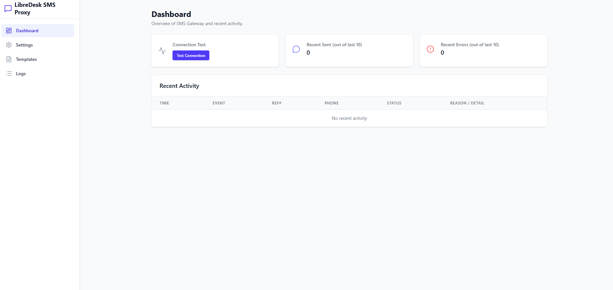
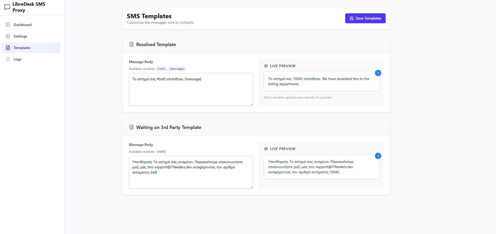

# LibreDesk SMS Proxy

A full-stack middleware/proxy solution to connect [LibreDesk](https://libredesk.org/) webhook events to contacts via the [SMSGate](https://sms-gate.app/) Android app.

### UI/UX:





## Features
- **Auto-SMS on Ticket Resolution**: Sends a template SMS when a LibreDesk conversation status is changed to `Resolved`.
- **Waiting on 3rd Party Notification**: Sends a template SMS when the tag `waiting-on-third-party` is added to a conversation.
- **Deduplication**: Prevents spamming users by honoring cooldown periods for SMS types.
- **SMSGate Authentication Auto-Detect**: Works locally with Basic Auth or via the Public Cloud using JWT Bearer flows.
- **Admin Dashboard**: See connection statuses, SMS statistics, full activity logs, and configure active templates and rules.

---

## 🚀 Setup Steps

### 1. Requirements
- Node.js 25 (or Node 18+)
- PM2 (optional, for daemonization)
- LibreDesk webhook access

### 2. Installation
1. Clone this repository or copy the folder to your server.
2. Install dependencies:
   ```bash
   npm install
   ```
3. Copy environment config:
   ```bash
   cp .env.example .env
   ```
4. Build the React frontend:
   ```bash
   npm run build
   ```

### 3. Deployment
```bash
npm start
```
runs on port 3400 the server returns 404 on browsers but works only if it get requests from libredesk and your domain

```bash
npm run dev:client
```
runs on port 5173 the client

The admin dashboard will now be reachable at `http://YOUR_SERVER_IP:5173/`


## ⚙️ Configuration Guide

### SMSGate App Setup (Android)
If you run SMSGate in **Local Server** mode:
1. Note the IP shown on your Android app (e.g., `http://192.168.1.100:8080`).
2. Add a Username and Password in the SMSGate app settings.
3. Enter these details in this app's **Settings** tab. It will use Basic Auth.

If you run SMSGate in **Cloud Mode** (https://api.sms-gate.app):
1. Note your Cloud credentials on SMSGate.
2. Enter the cloud URL, username, and password in this app's **Settings** tab. The proxy will automatically fetch and manage JWT tokens.

### LibreDesk Webhook Setup
1. Open your LibreDesk Admin Settings > Webhooks.
2. Add a new Webhook:
   - **URL**: `http://YOUR_SERVER_IP:3400/webhook/libredesk`
   - **Secret**: Generate a strong secret (or copy an existing).
   - **Events**: Subscribe to `conversation.status_changed` and `conversation.updated`.
3. In this application's **Settings** tab, paste the LibreDesk webhook secret so HMAC signatures can be verified.

## Troubleshooting
All outbound SMS events, including skipped reasons and connectivity errors, are logged under the **Logs** tab in the admin dashboard.

WARNING: ⚠ ⚠ ⚠ 
this repo is vibe coded to hell DO NOT use it on professional enviroment without hardening it first i create it in 6 hours only because i was bored and i though it would be cool to have sms notifications for my libredesk tickets