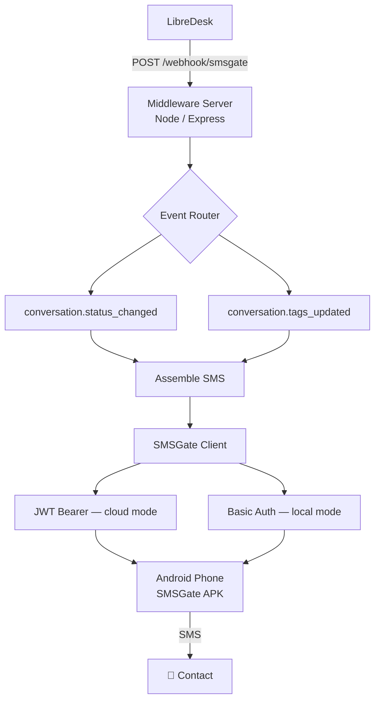

## Architecture

```mermaid
flowchart TD
    A[LibreDesk] -->|POST /webhook/smsgate| B[Middleware Server\nNode / Express]

    B --> C{Event Router}
    C --> C1[conversation.status_changed]
    C --> C2[conversation.tags_updated]

    C1 --> D[Assemble SMS]
    C2 --> D

    D --> E[SMSGate Client]
    E --> E1[JWT Bearer — cloud mode]
    E --> E2[Basic Auth — local mode]

    E1 --> F[Android Phone\nSMSGate APK]
    E2 --> F

    F -->|SMS| G[📱 Contact]
```